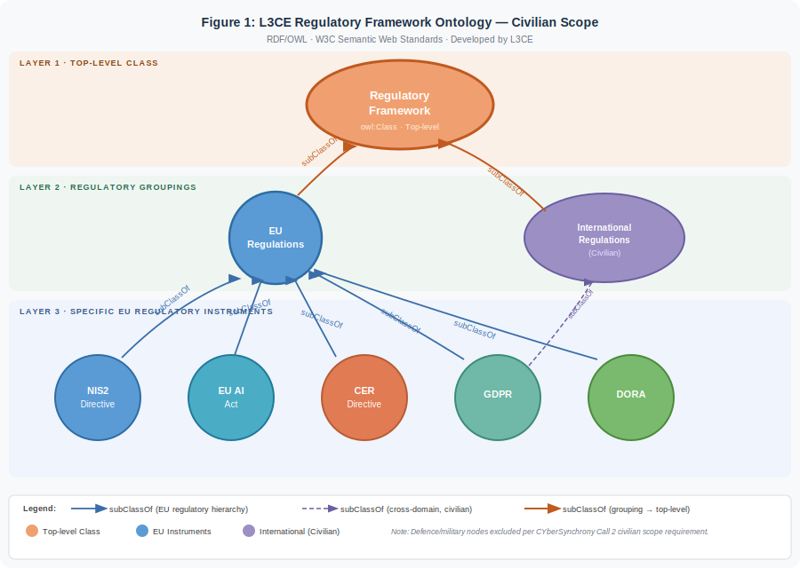

# NIS2 Ontology-Driven Compliance Integration for the CyberSynchrony Ecosystem

**Lithuanian Cybercrime Centre of Excellence for Training, Research, and Education (L3CE)**  
Vilnius, Lithuania

[](https://creativecommons.org/licenses/by/4.0/)
[](https://www.w3.org/OWL/)
[](https://www.w3.org/TR/sparql11-query/)
[](https://www.stardog.com/)
[](https://secOntologyLab.github.io/nis2-compliance-ontology)

---

## Overview

This repository presents L3CE's **NIS2 Compliance Ontology** — a formal semantic framework that automatically derives specific NIS2 Article 21 compliance gaps from penetration test findings, without manual analysis.

The ontology connects four layers through three semantic properties, enabling a single SPARQL query to traverse the complete chain from a CVE vulnerability instance to the specific NIS2 legal obligation it violates:

```
CVE finding → CWE weakness class → failed control → violated NIS2 Art.21 obligation
```

This work is developed as part of L3CE's broader programme of ontology-driven regulatory compliance research, alongside:
- [EPMwDC](https://github.com/l3ce/epmdwc-ontology) — Dual-use regulatory compliance ontology (Open Research Europe, 2024)
- [HIPSTer](https://github.com/l3ce/hipster-framework) — Hybrid threat detection framework

The framework is designed for integration with the **CyberSynchrony ecosystem** (CYRESCUE, CYBERGOPLUS, CYBERRA, CROSS-CORE, CYBERWISE) and validated against the NIS2 Directive's Article 21 security measure requirements across energy, transport, and water sector essential entities.

---

## Repository Structure

```
nis2-compliance-ontology/
│
├── ontology/
│   └── nis2_compliance.ttl          # Core ontology — RDF/OWL (Turtle syntax)
│
├── sparql/
│   ├── validation_query.sparql      # Full four-hop reasoning chain query
│   └── diagnostic_queries.sparql   # Step-by-step diagnostic queries
│
├── figures/
│   ├── figure1_regulatory_framework.svg   # Regulatory context layer (civilian)
│   └── figure2_evidence_layer.svg         # Four-layer evidence ontology
│
├── demo/
│   └── NIS2_Compliance_Ontology_Interactive_Demo.html     # Interactive visualisation (GitHub Pages)
│
├── validation/
│   └── stardog_validation_results.png     # STARDOG Cloud query results screenshot
│
└── README.md
```

---

## The Ontology

### Four Layers

| Layer | Content | OWL construct |
|---|---|---|
| 1 — NIS2 Art.21 Obligations | Seven specific security measure requirements of NIS2 Art.21(2) | `owl:Class`, `rdfs:subClassOf` |
| 2 — Control Categories | Implementation-level controls, mapped to NIST SP800-53 | `owl:Class`, `owl:ObjectProperty` |
| 3 — CWE Weakness Classes | MITRE CWE taxonomy entries, linked via `owl:sameAs` | `owl:Class`, `owl:ObjectProperty` |
| 4 — CVE Instances | Specific pen test findings (CYRESCUE output) | `owl:NamedIndividual` |

### Three Semantic Properties

| Property | Domain | Range | Meaning |
|---|---|---|---|
| `nis2:satisfies` | ControlCategory | Article21Obligation | A control fulfils a legal obligation |
| `nis2:indicatesFailureOf` | CWEWeaknessClass | ControlCategory | A weakness signals a control has failed |
| `nis2:instanceOfWeakness` | CVEInstance | CWEWeaknessClass | A CVE is classified under a CWE category |

### Namespace

```turtle
@prefix nis2: <https://l3ce.eu/ontology/nis2#> .
```

---

## The Reasoning Chain

The complete automated compliance derivation is executed by a single SPARQL query:

```sparql
PREFIX rdf:  <http://www.w3.org/1999/02/22-rdf-syntax-ns#>
PREFIX nis2: <https://l3ce.eu/ontology/nis2#>

SELECT ?cve ?cwe ?control ?obligation ?article
WHERE {
  ?cve  rdf:type                 nis2:CVEInstance ;
        nis2:instanceOfWeakness  ?cwe .
  ?cwe  nis2:indicatesFailureOf  ?control .
  ?control nis2:satisfies        ?obligation .
  ?obligation nis2:articleRef    ?article .
}
ORDER BY ?cve ?obligation
```

### Validated Results (21 February 2026 — STARDOG Cloud)

| CVE | CWE | Control | NIS2 Obligation | Article Reference |
|---|---|---|---|---|
| CVE-2023-44487 | CWE-400 | IncidentDetectionControl | Art21_2b | NIS2 Art.21(2)(b) — Incident Handling |
| CVE-2024-1234-Example | CWE-522 | EncryptionControl | Art21_2h | NIS2 Art.21(2)(h) — Cryptography |
| CVE-2024-1234-Example | CWE-522 | AuthenticationControl | Art21_2i | NIS2 Art.21(2)(i) — Access Control |
| CVE-2024-1234-Example | CWE-522 | AuthenticationControl | Art21_2j | NIS2 Art.21(2)(j) — MFA |
| CVE-2024-21413 | CWE-287 | AuthenticationControl | Art21_2i | NIS2 Art.21(2)(i) — Access Control |
| CVE-2024-21413 | CWE-287 | AuthenticationControl | Art21_2j | NIS2 Art.21(2)(j) — MFA |

**6 compliance gaps automatically derived from 3 CVE findings. Zero manual mapping steps.**

See `validation/stardog_validation_results.png` for the full STARDOG query screenshot.

---

## 🔴 Live Interactive Demo

**[→ Click here to launch the NIS2 Compliance Ontology Interactive Demo](https://secOntologyLab.github.io/nis2-compliance-ontology/demo/NIS2_Compliance_Ontology_Interactive_Demo.html)**

Click any **CVE node** to trace the full automated reasoning chain from pen test finding to NIS2 Article 21 compliance gap in real time.

Features:
- Four-layer cascade from NIS2 Art.21 obligations down to CVE instances
- Edge filter buttons isolating `satisfies`, `indicatesFailureOf`, `instanceOfWeakness`, and `subClassOf` relationships
- Click any CVE node to open the live SPARQL reasoning panel — showing the full four-hop chain, the query, and the derived Article 21 compliance gaps
- Hover tooltips on all nodes surfacing NIST SP800-53 mappings, risk ratings, CVSS scores, and Article references

---

## CyberSynchrony Integration Architecture

The ontology is designed as a semantic middleware layer connecting CyberSynchrony modules:

```
[CYRESCUE pen test output]
        ↓ CVE instances ingested via REST API
[L3CE NIS2 Compliance Ontology — SPARQL endpoint]
        ↓ Structured Art.21 compliance gaps
[CYBERGOPLUS compliance dashboard]
        ↓
[CROSS-CORE — NCC reporting under NIS2 Art.23]
        +
[CYBERWISE — awareness training triggers from recurring findings]
```

**Integration requirements:**
- CYRESCUE output: JSON with CVE ID, CVSS score, affected asset
- Ontology endpoint: SPARQL 1.1, STARDOG Cloud (horizontally scalable)
- CYBERGOPLUS input: REST API/JSON posture metrics and Art.21 gap data
- CROSS-CORE output: structured Art.21 references for Art.23 NCC reporting

---

## Figures

### Figure 1 — Regulatory Framework (Civilian Scope)


*The L3CE Regulatory Framework ontology models NIS2 within the broader EU civilian regulatory landscape, using `subClassOf` hierarchies connecting NIS2, EU AI Act, CER Directive, GDPR, and DORA to a top-level Regulatory Framework class. Defence and military nodes excluded per civilian application scope.*

### Figure 2 — Evidence Layer (Art.21 → CVE)


*Extends Figure 1 downward through four operational layers: NIS2 Article 21 obligations, control categories, CWE weakness classes, and CVE instances. Three semantic properties enable automated four-hop reasoning from pen test finding to NIS2 legal obligation.*

---

## Related L3CE Publications and Repositories

| Work | Description | Status |
|---|---|---|
| [EPMwDC Ontology](https://github.com/l3ce/epmdwc-ontology) | Dual-use regulatory compliance ontology | Published — Open Research Europe, 2024 |
| [HIPSTer Framework](https://github.com/l3ce/hipster-framework) | Hybrid threat detection — OSINT/SoCMINT | Under review — Journal of Intelligent Communication |
| NIS2 Compliance Ontology | This repository | Active development — February 2026 |

---

## How to Load and Query

### STARDOG Cloud
1. Create a new database (reasoning profile: SL or RL)
2. Import `ontology/nis2_compliance.ttl` into the default graph
3. Run `sparql/validation_query.sparql` in the query interface
4. Expected output: 6 result rows as tabulated above

### Any SPARQL 1.1 Triplestore
The ontology is standard RDF/OWL and compatible with any W3C-compliant triplestore (Apache Jena, GraphDB, Oxigraph, etc.)

---

## Licence and Citation

This work is licensed under [Creative Commons Attribution 4.0 International (CC BY 4.0)](https://creativecommons.org/licenses/by/4.0/).

If you use this ontology in your research or projects, please cite:

```bibtex
@misc{l3ce_nis2_ontology_2026,
  author       = {Andrew, R.},
  title        = {NIS2 Ontology-Driven Compliance Integration for the CyberSynchrony Ecosystem},
  year         = {2026},
  publisher    = {GitHub},
  institution  = {Lithuanian Cybercrime Centre of Excellence (L3CE)},
  url          = {https://github.com/l3ce/nis2-compliance-ontology}
}
```

---

## Contact

**Dr R. Andrew**  
Senior Research Associate, Strategic Lead & Ontology Architect  
Lithuanian Cybercrime Centre of Excellence (L3CE)  
Mykolas Romeris University  
Vilnius, Lithuania  

*Part of L3CE's ontology-driven regulatory compliance research programme.*
